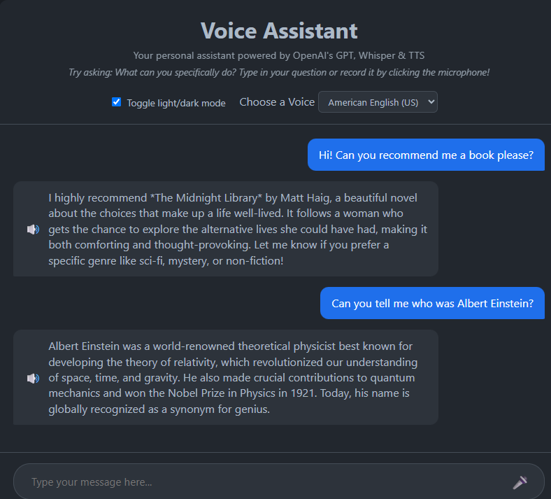

# AI Voice Assistant 🎙️

An open-source, lightweight, and fully functional **AI Voice Assistant** built with Python, Flask, `faster-whisper` for local Speech-to-Text (STT), Google Gemini API for intelligent LLM responses, and `edge-tts` for high-quality neural speech synthesis.

Designed for 100% free-of-cost local execution without requiring Docker or paid API subscriptions for audio processing.

---

## 📸 User Interface

<p align="center">
  
</p>

---

## ✨ Features

* **Local Speech-to-Text (STT):** Fast, privacy-focused voice transcription using `faster-whisper` running locally on CPU (`int8` quantization).
* **Resilient Gemini Fallback:** Automated model fallback loop (`gemini-3.5-flash` ➔ `gemini-2.0-flash` ➔ `gemini-1.5-flash`) to prevent service interruption during API rate limits.
* **Neural Text-to-Speech (TTS):** Dynamic, realistic speech synthesis powered by `edge-tts` with selectable voice profiles.
* **Interactive Web Dashboard:** Modern, responsive UI supporting real-time audio recording, text messaging, and Dark/Light theme toggling.

---

## 🛠️ Tech Stack

* **Backend:** Python 3.10+, Flask, Flask-CORS, python-dotenv
* **Speech-to-Text:** `faster-whisper`
* **LLM Engine:** Google Gemini API (`google-genai` SDK)
* **Text-to-Speech:** `edge-tts`
* **Audio Transcoding:** `FFmpeg`

---

## 📋 Prerequisites

Before running the project, ensure you have installed:

1. **Python 3.10+**
2. **FFmpeg** (Mandatory for audio conversion between browser recordings and Whisper):
   * **Windows:** `winget install FFmpeg`
   * **macOS:** `brew install ffmpeg`
   * **Linux:** `sudo apt install ffmpeg`
3. **Google Gemini API Key:** Get a free API key from [Google AI Studio](https://aistudio.google.com/).

---

## 📁 Repository Structure

```text
AI-Voice-Assistant/
├── static/
│   ├── script.js        # Audio recording & backend communication
│   └── style.css        # Responsive layout & theme styling
├── templates/
│   └── index.html       # Web dashboard interface
├── .env.example         # Environment template
├── .gitignore           # Excluded files
├── README.md            # Project documentation
├── requirements.txt     # Python dependencies
├── server.py            # Flask HTTP server & endpoints
└── worker.py            # STT, Gemini fallback, and TTS core logic
```

---

## 🚀 Quick Start Guide

### 1. Clone the Repository
```bash
git clone [https://github.com/YOUR_USERNAME/AI-Voice-Assistant.git](https://github.com/YOUR_USERNAME/AI-Voice-Assistant.git)
cd AI-Voice-Assistant
```

### 2. Create and Activate Virtual Environment
* **Windows:**
  ```cmd
  python -m venv my_venv
  my_venv\Scripts\activate
  ```
* **macOS / Linux:**
  ```bash
  python3 -m venv my_venv
  source my_venv/bin/activate
  ```

### 3. Install Dependencies
```bash
pip install -r requirements.txt
```

### 4. Configure Environment Variables (`.env`)
Copy the template file `.env.example` and **rename it to `.env`** (removing the `.example` extension):

* **Windows:** `copy .env.example .env`
* **macOS/Linux:** `cp .env.example .env`

Open the newly created `.env` file in your text editor and paste your Google Gemini API key:
```env
GEMINI_API_KEY=your_actual_gemini_api_key_here
```

### 5. Run the Application
```bash
python server.py
```
Open your browser and navigate to `http://localhost:8000`.

---

## ❓ Troubleshooting

* **Microphone Access Denied:** Grant audio recording permissions to `http://localhost:8000` in browser site settings.
* **API Key Error:** Verify that your `.env` file is named correctly (without `.example`) and contains a valid API key.
